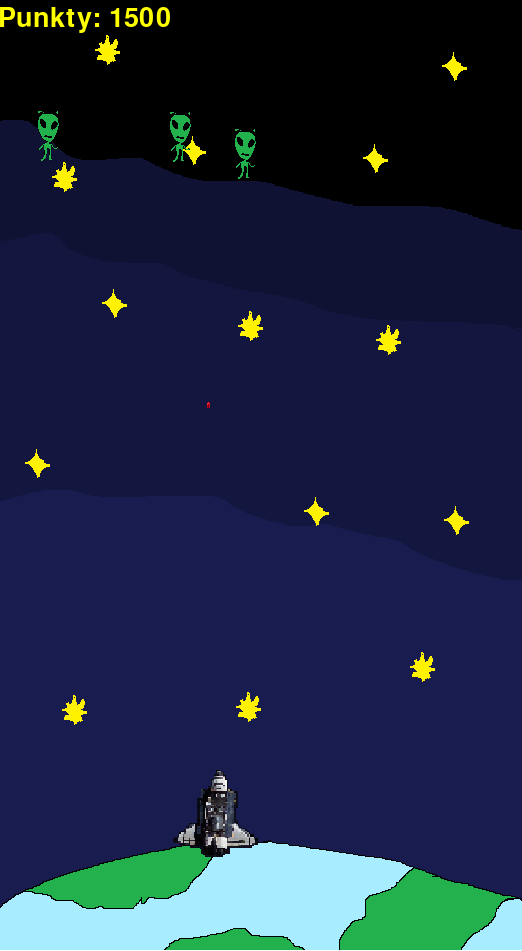
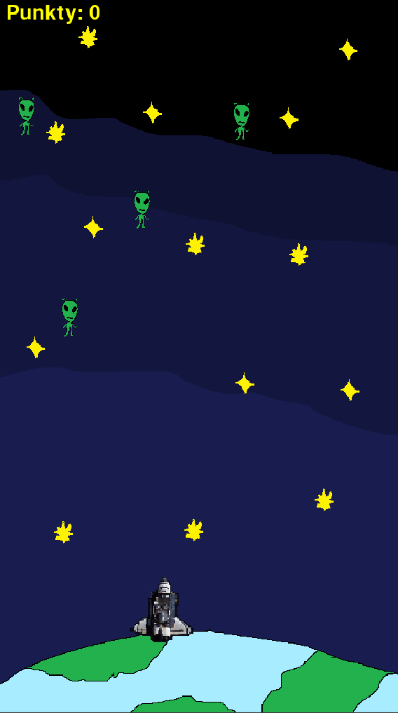
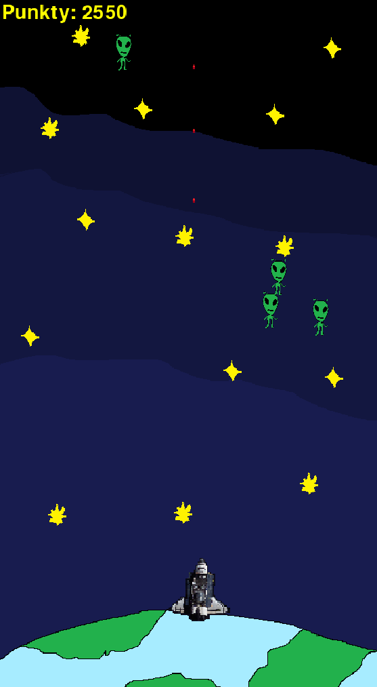

## 🎮 Opis gry

Gra typu **retro space shooter**, inspirowana klasycznymi grami arcade.

Na dole ekranu znajduje się **statek kosmiczny** broniący Ziemi. Z górnej części planszy nadlatują **zieloni kosmici**, którzy poruszają się w różne strony. Zadaniem gracza jest zestrzelenie ich

Tło gry przedstawia **kosmos pełen gwiazd**, co nadaje całości klimatu starych gier z automatów. W lewym górnym rogu wyświetlany jest aktualny wynik gracza (**Punkty**).


## 🕹️ Mechanika gry

* Sterowanie statkiem kosmicznym
* Ruch w **lewo i prawo**
* **Strzelanie** do przeciwników
* Każdy trafiony kosmita zwiększa liczbę punktów
* Gra ma prostą, arcade’ową mechanikę nastawioną na refleks


## 👾 Styl

* Grafika 2D w stylu retro
* Proste sprite’y kosmitów i statku
* Klimat klasycznych gier typu *Space Invaders*

## 📸 Screenshoty

<p align="center">
  
  
  
</p>

## 🚀 Jak uruchomić

1. Zainstaluj Pythona 3.10 lub nowszego
2. Zainstaluj zależności:

```bash
pip install -r requirements.txt
